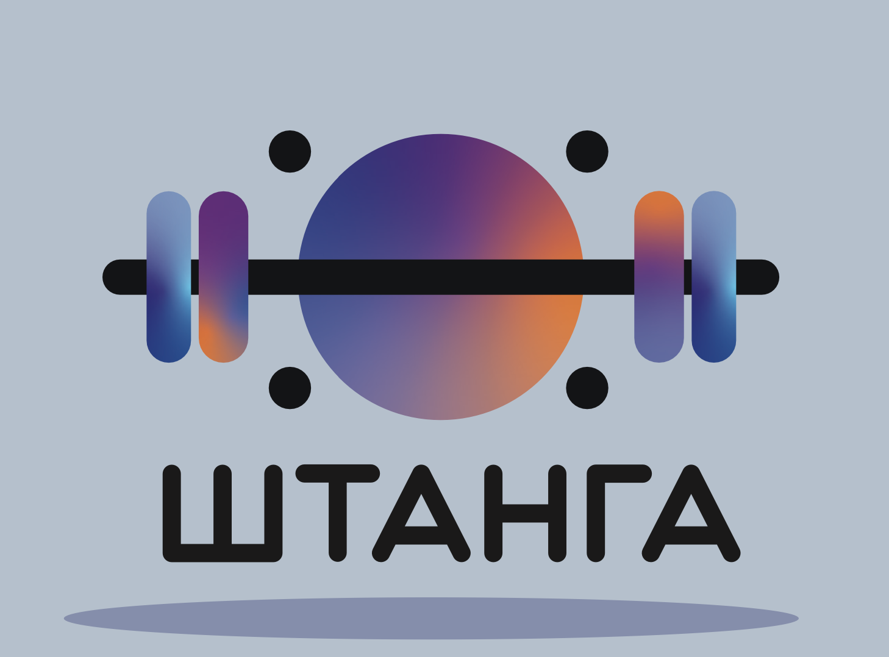

<p align="center">
      <br/>
     <H2 align="center">Команда Штанга</H2> 
    <H2 align="center">Кейс "Разметка видеоконтента"</H2> 
</p>

<a target="_blank" href="https://cookiecutter-data-science.drivendata.org/">
    
</a>


**Описание проекта**

Этот репозиторий содержит исходный код и ресурсы для веб-сервиса, который позволяет загружать видео-контент и автоматизирует его разметку, выделяя ключевые объекты, сцены, символику, points of interest, звуковое и музыкальное сопровождение, а также проводит полную транскрибацию текста.
В рамках сервиса реализован умный поиск, позволяющий искать видео, как по всем типам разметки, в том числе по звукам и тексту.
Также было к базе данных сервиса подключен интерактивный, позволяющий отслеживать распределение по разметке.

**Архитектура решения**
**Технологии**
- **ML Pipline**: Clap, Whisper-large-v3, InternVL2-8B, GigaChat, ZhengPeng7/BiRefNet
- **Веб-приложение**: React, FastApi
- **Базы данных**: PostgreSQL, Redis
- **Файловое хранилище**: Minio
- **Балансировка нагрузки**: Traefik
- **Дашборд**: Grafana


# **Использование**
+ 1 вариант
  - Перейдите по [ссылке](http://194.87.26.211/) и наслаждайтесь web-сервисом
+ 2 вариант, в docker
  - Клонируйте репозиторий: ```git clone https://github.com/VladikTI/GMH-video-analyzing-service.git```
  - запустить все миикросервисы из docker-compose: ```docker-compose up```
+ 3 просмотр дашборда доступен по [ссылке](http://194.87.26.211:3000/)


---

[Screencast](https://disk.yandex.ru/i/7L2D8G5zPMsnrw) наших сервисов

---

## **Пример загрузки видео**

***Загрзучик файла:***

<p align="center">
      <br/>
</p>

***Просмотр информции о разметке:***

<p align="center">
      <br/>
</p>


## **Пример поиска по меткам**

***Поиск по категории и транскрибированной речи:***

<p align="center">
      <br/>
</p>


## **Пример работы с дашбордом**

***Просмотр графика распределения по категоримя:***

<p align="center">
      <br/>
</p>
